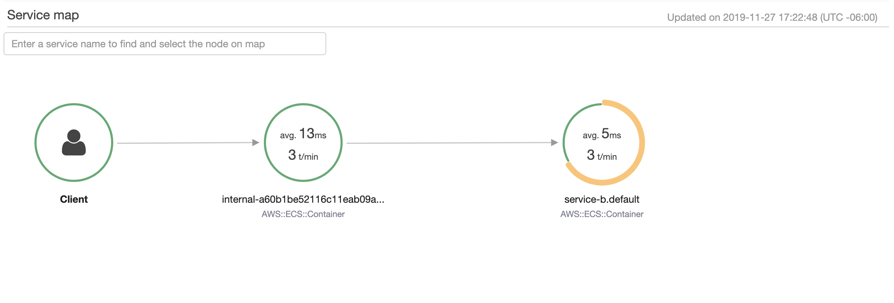
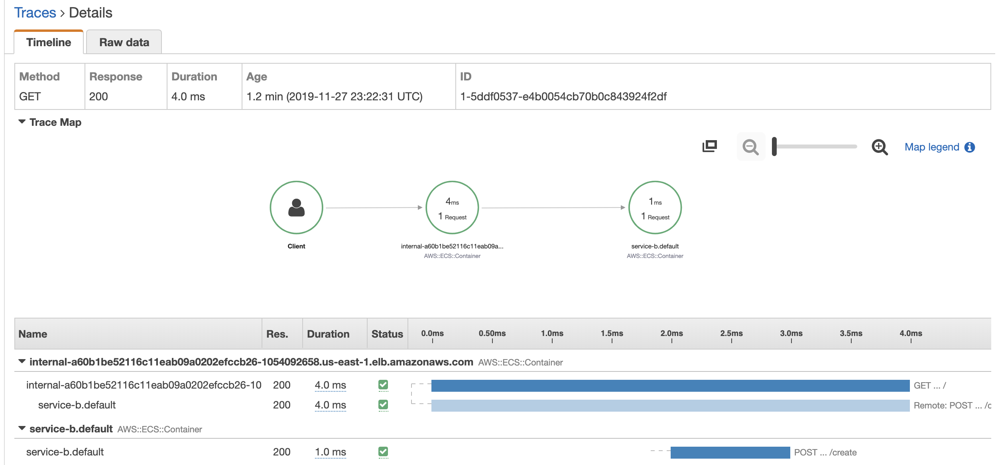

# Application Tracing on Kubernetes with AWS X-Ray

[AWS X-Ray](https://aws.amazon.com/xray/) provides application-tracing functionality, giving deep insights into all microservices deployed. With X-Ray, every request can be traced as it flows through the involved microservices. This provides your DevOps teams the insights they need to understand how your services interact with their peers and enables them to analyze and debug issues much faster.

X-Ray agent is deployd as daemonset on top of Kubernetes to provide application tracing capabilities to services hosted on a Kubernetes cluster.

## Connecting to the X-Ray daemon

To integrate application tracing with your applications, use the X-Ray SDK for one of the supported programming languages:

    * Java
    * Node.js
    * .NET (Framework and Core)
    * Go
    * Python

The SDKs provide classes and methods for generating and sending trace data to the X-Ray daemon. Trace data includes information about incoming HTTP requests served by the application, and calls that the application makes to downstream services using the AWS SDK or HTTP clients.

By default, the X-Ray SDK expects the daemon to be available on `127.0.0.1:2000`. This needs to be changed in this setup, as the daemon is not part of each Pod but hosted within its own Pod.

The deployed X-Ray DaemonSet exposes all Pods via the Kubernetes service discovery, so applications can use this endpoint to discover the X-Ray daemon. The endpoint is:

`xray-service.amazon`

Applications now need to set the daemon address either with the `AWS_XRAY_DAEMON_ADDRESS` environment variable (preferred) or directly within the SDK setup code:

```javascript
AWSXRay.setDaemonAddress('xray-service.amazon:2000');
```

To set up the environment variable, include the following information in your Kubernetes application deployment description YAML. That exposes the X-Ray service address via the environment variable, where it is picked up automatically by the SDK.

```yaml
env:
- name: AWS_XRAY_DAEMON_ADDRESS 
  value: xray-service.amazon
```

## Sending tracing information to AWS X-Ray

Sending tracing information from your application is straightforward with the X-Ray SDKs. Because your application is running within containers, enable both the EC2Plugin and ECSPlugin, which gives you information about the Kubernetes node hosting the Pod as well as the container name. Despite the name ECSPlugin, this plugin gives you additional information about your container when running your application on Kubernetes.

For more information about all options and possibilities to instrument your application code, see the [X-Ray documentation page](https://docs.aws.amazon.com/xray/index.html) for the corresponding SDK information.


The picture below shows the resulting service map that provides insights into the flow of requests through the microservice landscape. You can drill down here into individual traces and see which path each request has taken.



From the service map, you can drill down into individual requests and see where they originated from and how much time was spent in each service processing the request.




## References

* https://aws.amazon.com/blogs/compute/application-tracing-on-kubernetes-with-aws-x-ray/
* https://docs.aws.amazon.com/xray/index.html
* https://github.com/aws-samples/aws-xray-kubernetes
* https://github.com/aws-samples/aws-xray-kubernetes-serverless
* https://github.com/aws-samples/aws-xray-cloudwatch-event
