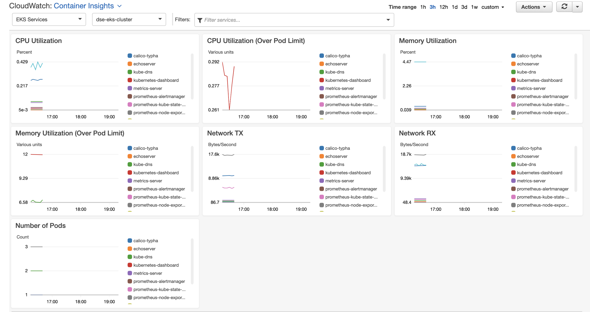
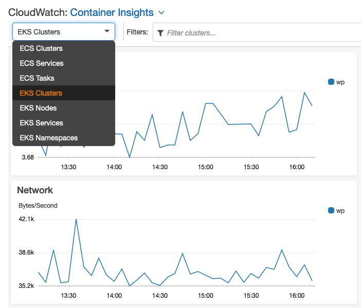

You can use CloudWatch Container Insights to collect, aggregate, and summarize metrics and logs from your containerized applications and microservices. Container Insights is available for Amazon Elastic Container Service, Amazon Elastic Kubernetes Service, and Kubernetes platforms on Amazon EC2. The metrics include utilization for resources such as CPU, memory, disk, and network. Container Insights also provides diagnostic information, such as container restart failures, to help you isolate issues and resolve them quickly.

You can find the full information and manual install steps here:
https://docs.aws.amazon.com/AmazonCloudWatch/latest/monitoring/Container-Insights-setup-EKS-quickstart.html 

To verify that data is being collected in CloudWatch, launch the CloudWatch Containers UI in your browser:
https://us-east-1.console.aws.amazon.com/cloudwatch/home?region=us-east-1#cw:dashboard=Container

**You may need to copy and paste the above link into your browser**

From here you can see the metrics are being collected and presented to CloudWatch. You can switch between various drop downs to see EKS Services, EKS Cluster and more. 

